# User Guide

## Getting started
Users should follow the steps below to start the PROBE3.0 Design Enablement process.
- Set a specific directory as your Design Enablement home directory
  - ex. /home/user/***PROBE3.0***
- Download **Makefile** and **inputs**, **scripts** directories under the home directory
  - ex. /home/user/PROBE3.0/***Makefile***
  - ex. /home/user/PROBE3.0/***inputs***/*
  - ex. /home/user/PROBE3.0/***scripts***/*
- Enter *'make **setup**'* to create required directories

## Configuration setting using [*config.mk*](https://github.com/ABKGroup/PROBE3.0/blob/28ab2ed753f49d89c84c61175b12ef52c12e72d2/DesignEnablement/Cadence_Synopsys/inputs/config.mk)
Before the Design Enablement process, insert the important technology and design information into the *config.mk* file.
- Technology parameters are explained as illustrated below, inside the *config.mk* file.

| 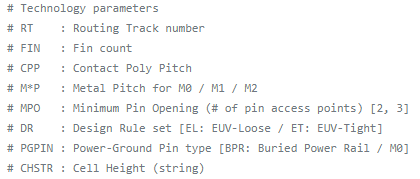 |
|:--:|

- Each parameter is described graphically in the image below.

| 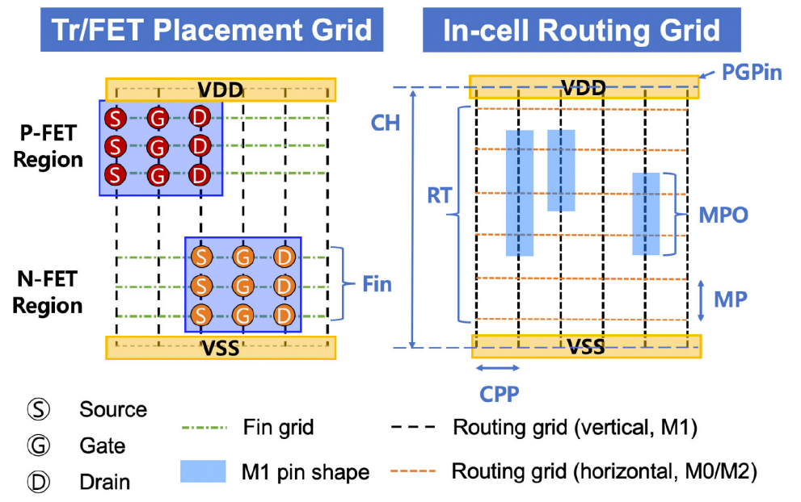 |
|:--:|

- RT (Routing Track) and CHSTR (Cell Height String) have the following relationship:
  - if PGPIN = M0, CHSTR = RT+2
  - if PGPIN = BPR, CHSTR = RT+1

- Standard cells are listed in 'CELLS'; the predefined 41 cells are summarized in the table below.
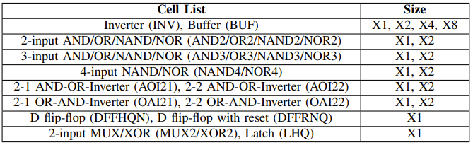

- The four types of power delivery are described below.

| 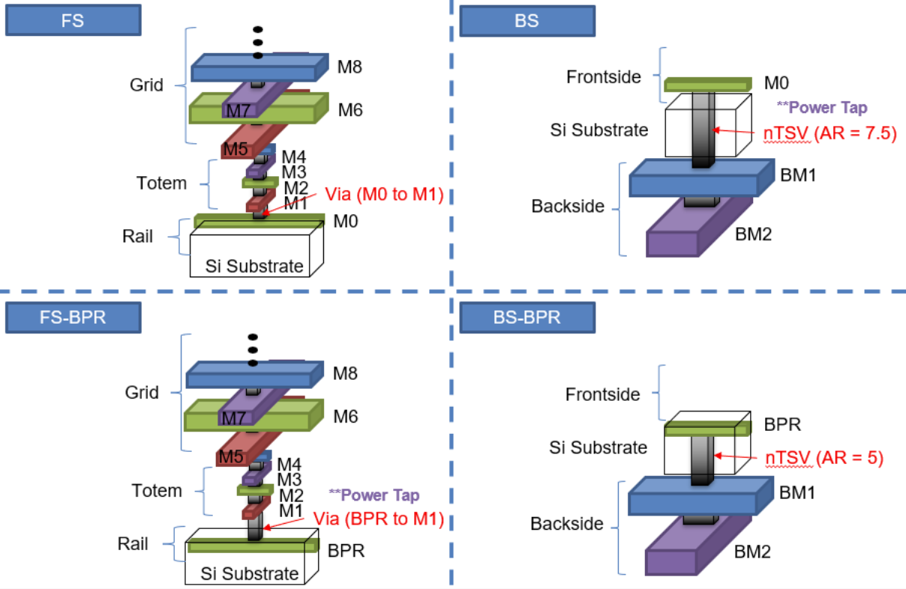 |
|:--:|


## TLUPlus and NXTGRD files generation (command: [*tlupgen*](https://github.com/ABKGroup/PROBE3.0/blob/cb2bc6fd682661ed8f87f1f61603d9d6a14bc8c4/DesignEnablement/Cadence_Synopsys/Makefile#L31), [*grdgen*](https://github.com/ABKGroup/PROBE3.0/blob/e24c2d6c2f23013d048c8149c86e0f094ac6230a/DesignEnablement/Cadence_Synopsys/Makefile#L37))
TLUPlus and NXTGRD files are used for the Synopsys ICC2 flow. For this, the ITF file (*\*.itf*) must be prepared in the 'inputs' directory. As various technology values are defined in this ITF file, users can change technology values by modifying this ITF file.

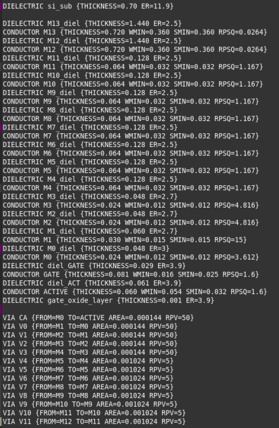

Note that the Synopsys StarRCXT must be installed to use the *grdgenxo* command. In the PROBE3.0 flow, StarRCXT O-2018.06-SP5-6 version was used. Input and Output files and their locations are summarized below.

- **Input File**
  - ITF file (*.itf)
  - Location
    - inputs/PROBE.itf
- **Output File**
  - *tlupgen*: TLUPlus file (*.tlup)
  - *grdgen*: nxtgrd file (*.nxtgrd)
  - Location
    - results/tlup/PROBE.tlup
    - results/nxtgrd/PROBE.nxtgrd

\*\* Notice: ITF file does not work properly with the copyright header lines. Please remove the header lines before using the ITF file as an input.

## QRC file generation (command: [*qrcgen*](https://github.com/ABKGroup/PROBE3.0/blob/e24c2d6c2f23013d048c8149c86e0f094ac6230a/DesignEnablement/Cadence_Synopsys/Makefile#L43))
QRC file is used for the Cadence Innovus flow. For this, the ICT file (*\*.ict*) must be prepared in the 'inputs' directory. As various technology values are defined in this ICT file, users can change technology values by modifying this ICT file.

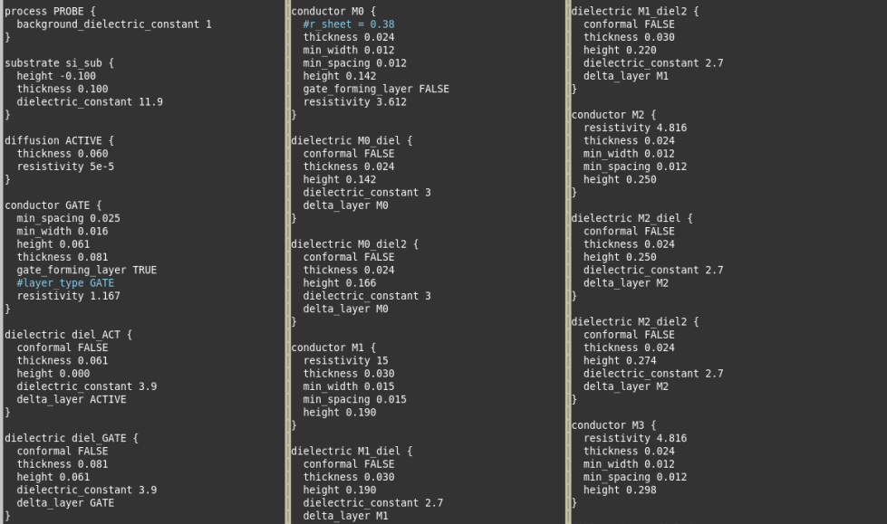

In the 'inputs' directory, four types of ICT files (FS / FSBPR / BS / BSBPR) are uploaded. For the Cadence Innovus application, please use the FS type only regardless of the power delivery type. Other types are uploaded for use in the Cadence Voltus application.

Note that the Cadence Quantus must be installed to use the *Techgen* command. In the PROBE3.0 flow, Quantus 21.1 version was used. Input and Output files and their locations are summarized below.

- **Input File**
  - ICT file (*.ict)
  - Location
    - inputs/PROBE_*.ict
- **Output File**
  - QRC tech file (*.tch)
  - Location
    - results/qrc/PROBE_*.tch

## Standard-cell layout generation (command: [*stdgen*](https://github.com/ABKGroup/PROBE3.0/blob/e24c2d6c2f23013d048c8149c86e0f094ac6230a/DesignEnablement/Cadence_Synopsys/Makefile#L51))
Standard-cell layout files are generated using this command. By running this command, *\*.pinlayout* files are converted to *\*.conv* files. 

As this flow does not use any commercial tool, users do not need to install any Synopsys or Cadence tool. However, users need to download the Z3 solver from the website given below. In the PROBE3.0 flow, the 4.8.5 version was used, and it can be downloaded from this link:
- **Z3 Solver** (ver 4.8.5) Download path https://github.com/Z3Prover/z3/archive/refs/tags/Z3-4.8.5.tar.gz

Users can control the CPP (Contacted Poly Pitch) to M1P (M1 metal Pitch) ratio by changing the two variables in the *genSMTInput.pl* script. Please refer to the image below for the variable description.

\*\* Note: The variable values below are not directly converted into [nm] units. The ratio of these variables formulates the gear ratio.
| 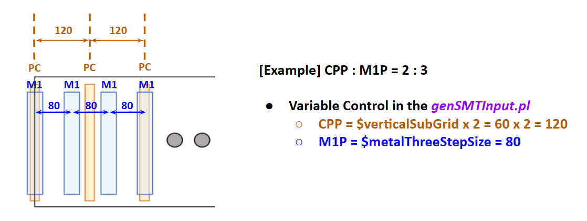 |
|:--:|

Input and Output files and their locations are summarized below.

- **Input File**
  - pinLayout files (*.pinLayout)
  - Location
    - inputs/pinLayouts_2F_4T/*.pinLayout
    - inputs/pinLayouts_3F_5T/*.pinLayout
- **Output File**
  - conv files (*.conv)
  - Location
    - results/solutionsSMT/2F_4T/*.conv
    - results/solutionsSMT/3F_5T/*.conv

## Standard-cell GDS and LEF generation (command: [*gdslefgen*](https://github.com/ABKGroup/PROBE3.0/blob/e24c2d6c2f23013d048c8149c86e0f094ac6230a/DesignEnablement/Cadence_Synopsys/Makefile#L65))
The *\*.conv* files created from the *stdgen* command are converted into GDS and LEF files by running this command. Like the *stdgen* command, this does not require installation of any commercial tool. However, users need to download the GDT2GDS script from its website. In the PROBE3.0 flow, the GDT-4.0.4 version was used and it can be downloaded from this link:
- **gdt2gds.Linux** (ver 4.0.4) Download path https://sourceforge.net/projects/gds2/

Input and Output files and their locations are summarized below.
- **Input File**
  - conv files (*.conv)
  - Location
    - results/solutionsSMT/2F_4T/*.conv
    - results/solutionsSMT/3F_5T/*.conv
- **Output File**
  - gds files (*.gds), lef files (*.lef)
  - Location
    - results/gdslefgen/[*lib_name*]/*.gds
    - results/gdslefgen/[*lib_name*]/*.lef

## Pin Layout file creation for custom cell applications

### General information of Pin Layout file

".pinLayout" is converted from CDL netlist as an input of the SMT-based standard-cell layout generation. There are cdl and pin layout files for 41 standard cells in the input directory. 

The pinLayout format includes four sections. 

1. Header
The header starts with the letter "a" and includes cell name, output path (not required), width/height of placement/routing clip and tracks per placement row. The width of routing/placement is the maximum cell width. As the cell size becomes larger, the runtime may increase. Tracks per placement row is calculated as #tracks/2 + 1. For example, the cell in the example below has 4 routing tracks; the value for tracks per placement row is 4/2 + 1 = 3. 

``` shell
a   PNR Testcase Generation::  DesignName = AND2_X1
a   Output File:
a   /home/eto10/PNR_PROBE/PNR_2F_4T/pinLayouts/AND2_X1.pinLayout
a   Width of Routing Clip    = 25
a   Height of Routing Clip   = 2
a   Tracks per Placement Row = 3
a   Width of Placement Clip  = 25
a   Tracks per Placement Clip = 2
```

2. Instance

The instance section starts with the letter "i" and it includes instance ID, type and width. The instance width is the same as the number of fins.

``` shell
i   ===InstanceInfo===
i   InstID Type Width
i   ins5 PMOS 2
i   ins4 PMOS 2
i   ins1 PMOS 2
i   ins3 NMOS 2
i   ins2 NMOS 2
i   ins0 NMOS 2
```

3. Pin

The pin section starts with the letter "i" and it includes pin ID, net ID, instance ID, pin name, pin direction and pin length. The pin name can be source, drain or gate. The pin direction can be s (source) or t (terminal). The pin length is the same as the number of fin.
The last rows are for external pins, for which the pin direction can be P (power/ground), I (input) or O (output).

``` shell
i   ===PinInfo===
i   PinID NetID InstID PinName PinDirection PinLength
i   pin0 net0 ins3 D s 2
i   pin1 net1 ins3 G s 2
i   pin2 net2 ins3 S s 2
i   pin3 net2 ins2 S t 2
i   pin4 net3 ins2 G s 2
i   pin5 net4 ins2 D s 2
i   pin6 net0 ins0 S t 2
i   pin7 net4 ins0 G t 2
i   pin8 net5 ins0 D s 2
i   pin9 net6 ins5 D s 2
i   pin10 net1 ins5 G t 2
i   pin11 net4 ins5 S t 2
i   pin12 net4 ins4 S t 2
i   pin13 net3 ins4 G t 2
i   pin14 net6 ins4 D t 2
i   pin15 net6 ins1 S t 2
i   pin16 net4 ins1 G t 2
i   pin17 net5 ins1 D t 2
i   pin18 net6 ext VDD t -1 P
i   pin19 net0 ext VSS t -1 P
i   pin20 net3 ext A1 t -1 I
i   pin21 net1 ext A2 t -1 I
i   pin22 net5 ext Z t -1 O
```

4. Net

The net section starts with the letter "i" and it includes net ID, the number of terminals, and pin list.

``` shell
i   ===NetInfo===
i   NetID N-PinNet PinList
i   net0 3PinNet pin19 pin6 pin0
i   net1 3PinNet pin21 pin10 pin1
i   net2 2PinNet pin3 pin2
i   net3 3PinNet pin20 pin13 pin4
i   net4 5PinNet pin16 pin12 pin11 pin7 pin5
i   net5 3PinNet pin22 pin17 pin8
i   net6 4PinNet pin18 pin15 pin14 pin9
```

### How to generate customized Pin Layout files

Users can apply customized circuits using the *genTestCase* scripts. There are two types of scripts according to fin counts; these are located in the 'scripts' folder.
- scripts/*genTestCase_2F.pl*
- scripts/*genTestCase_3F.pl*

And, users can define their custom circuit information using the CDL file as a reference. The CDL files are uploaded on the location below.
- inputs/*PROBE_2F.cdl*
- inputs/*PROBE_3F.cdl*

If the genTestCase script and input CDL file are ready, users can generate the resultant Pin Layout file (*\*.pinLayout*) by running the command below. One command line can generate one Pin Layout file for one cell. The [offset] parameter below is a size increment that the user may apply. This increments the size of the bounding box in which the SMT solver tries to find a cell layout. Users may need to apply a greater value of offset when the routing track resource is low.

``` shell
[command] ./genTestCase_[fin]F.pl [cell].cdl [offset]

[example] ./genTestCase_A7_2F.pl DFFHQN_X1.cdl 13
```

If the Pin Layout files are generated successfully, users can find the result files in the **'pinLayouts'** directory.

## Power tap cell LEF generation (command: [*taplefgen*](https://github.com/ABKGroup/PROBE3.0/blob/e24c2d6c2f23013d048c8149c86e0f094ac6230a/DesignEnablement/Cadence_Synopsys/Makefile#L74))
This command is for generating LEF of power tap cells. No commercial tools, and no specific input files, are required. All the required information is gathered from the *lib_name* which was set in the 'config.mk' file.

There are two types of power tap cells: FSBPR type and BS type. These are shown in the image below with labels (a) and (b), respectively.

| 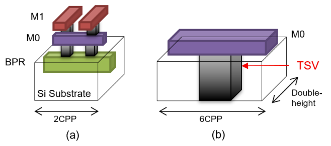 |
|:--:|

These power tap cells can be placed as shown in the image below, according to the relevant design scheme.

| 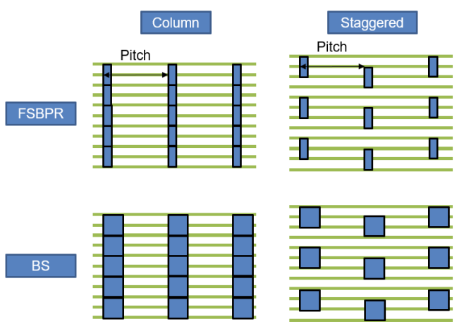 |
|:--:|

Input and Output files and their locations are summarized below.
- **Input Parameters**
  - Input parameters are obtained from [*lib_name*]
- **Output File**
  - lef files (*.lef)
  - Location
    - results/taplefgen/[*lib_name*]/*.lef

## Standard-cell LVS and Parasitic Extraction (command: [*lvspex*](https://github.com/ABKGroup/PROBE3.0/blob/e24c2d6c2f23013d048c8149c86e0f094ac6230a/DesignEnablement/Cadence_Synopsys/Makefile#L82))
By running this command, LVS (Layout Versus Schematic) of GDS is checked and parasitic extraction for characterization is implemented. To run this command, Cadence PVS and Quantus must be installed. The Cadence *Techgen* command requires Quantus, but users will likely have installed this already to enable the *qrcgen* command.

Input and Output files and their locations are summarized below.
- **Input File**
  - ICT file (*.ict)
  - CDL file (*.cdl), gds files (*.gds)
  - *lvs.pvl* file and *lvsfile*
  - Location
    - inputs/PROBE_*.ict
    - inputs/*.cdl, lvs.pvl, lvsfile
    - results/gdslefgen/[*lib_name*]/*.gds
- **Output File**
  - stdcell pex file (*.sp), LVS result files (*.pvslvs.log)
  - Location
    - logs/lvs/*.pvslvs.log
    - results/lvspex/*.sp

## LVS result check (command: [*lvssummary*](https://github.com/ABKGroup/PROBE3.0/blob/e24c2d6c2f23013d048c8149c86e0f094ac6230a/DesignEnablement/Cadence_Synopsys/Makefile#L112))
LVS logs which are created using *lvspex* are checked by running this command. No commercial tool is required.

The result file, *lvs.summary*, shows the LVS result with **MATCH** or **MISMATCH** as in the image below. Users need to check whether there is any MISMATCH in the LVS result list.

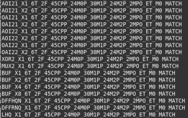

Input and Output files and their locations are summarized below.
- **Input File**
  - LVS result files (*.pvslvs.log)
  - Location
    - logs/lvs/*.pvslvs.logs
- **Output File**
  - LVS summary file (*lvs.summary*)
  - Location
    - logs/lvs/lvs.summary

## Standard-cell characterization (command: [*libchar*](https://github.com/ABKGroup/PROBE3.0/blob/e24c2d6c2f23013d048c8149c86e0f094ac6230a/DesignEnablement/Cadence_Synopsys/Makefile#L117))
This step is the characterization step for liberty and ldb generation. As this step uses Cadence Liberate, this tool must be installed before the command can be run. For PROBE3.0, Liberate version 16.1 was used.

To make this *libchar* run properly, the variables below must be set properly in the *config.mk* file.

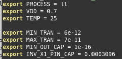

Input and Output files and their locations are summarized below.
- **Input File**
  - PEX files (*.sp)
  - Location
    - results/lvspex/*.sp
- **Output File**
  - ldb files (*.ldb.gz)
  - liberty files (*.lib)
  - Location
    - results/ldb/*.ldb.gz
    - results/lib/*.lib

## Standard-cell DB file generation (command: [*dbconv*](https://github.com/ABKGroup/PROBE3.0/blob/e24c2d6c2f23013d048c8149c86e0f094ac6230a/DesignEnablement/Cadence_Synopsys/Makefile#L125))
This step is for standard-cell DB file generation which will be used in the Synopsys ICC2 flow. Users who do not plan to use Synopsys ICC2 can skip this step. If a user needs to run this command, then Synopsys Library Compiler must be installed. For PROBE3.0, Library Compiler version L-2016.06-SP3-1 was used.

Input and Output files and their locations are summarized below.
- **Input File**
  - liberty files (*.lib)
  - Location
    - results/lib/*.lib
- **Output File**
  - DB files (*.db)
  - Location
    - results/lib/*.db

## Tech file generation for Synopsys PnR (command: [*techfilegen*](https://github.com/ABKGroup/PROBE3.0/blob/e24c2d6c2f23013d048c8149c86e0f094ac6230a/DesignEnablement/Cadence_Synopsys/Makefile#L133))
This step generates the tech file which will be used with Synopsys ICC2. It does not require any specific input file, but just extracts parameters defined in the *config.mk* file.

Input and Output files and their locations are summarized below.
- **Input Arguments**
  - LIB_NAME, BEOL, M2WIDTH
  - Definition
    - inputs/*config.mk*
- **Output File**
  - Synopsys tech file (*.tf)
  - Location
    - results/*.tf

## Tech LEF file generation for Cadence PnR (command: [*techlefgen*](https://github.com/ABKGroup/PROBE3.0/blob/e24c2d6c2f23013d048c8149c86e0f094ac6230a/DesignEnablement/Cadence_Synopsys/Makefile#L129))
This step generates the tech LEF file which will be used with Cadence Innovus. It does not require any specific input file, but just extracts parameters defined in the *config.mk* file.

Input and Output files and their locations are summarized below.
- **Input Arguments**
  - LIB_NAME, BEOL, M2WIDTH
  - Definition
    - inputs/*config.mk*
- **Output File**
  - Cadence tech lef file (*.tech.lef)
  - Location
    - results/*.tech.lef
