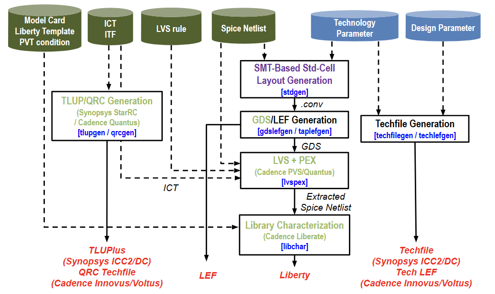

# PROBE3.0
PROBE3.0 is a systematic framework to conduct design-technology pathfinding for power, performance, area and cost (PPAC) in advanced nodes. The goal of our work is to build a “configurable” standard-cell library and process design kits (PDKs) generation with promising scaling boosters, such as backside power delivery network (BSPDN) and buried power rail (BPR), and study PPAC given technology and design parameters. 

This repository includes the design enablement part of the PROBE3.0 framework as well as post-design enablement (Logic Synthesis, Place-and-Route and IR Drop analysis) scripts. The outline of the flow is shown below and each step includes scripts for Cadence and/or Synopsys tools as well as open-source tools.

## Flow Chart

|  |
|:--:|
| *Overall Flow* |

## Command List
**[Common]**
- **make stdgen** : Standard-Cell Layout Generation
  - Input file: pinLayout file (*.pinLayout)
  - Required script: Z3 solver
- **make gdslefgen** : GDS/LEF generation
  - Input file: CONV file (*.conv)
  - Required script: gdt2gds.Linux
- **make taplefgen** : Power tap cell LEF generation
  - Input argument: LIB_NAME (e.g. *5T_2F_45CPP_24M0P_30M1P_24M2P_2MPO_ET_BPR*)
  
**[Cadence]**
- **make qrcgen** : QRC tech file generation
  - Input file: ICT file (PROBE_*.ict)
  - Tool: Cadence Quantus
- **make techlefgen** : Cadence *.tech.lef* generation
  - Input arguments: LIB_NAME, BEOL, M2WIDTH
- **make libchar** : Library characterization
  - Input file: PEX file (*.sp)
  - Tool: Cadence Liberate
  
**[Synopsys]**
- **make tlupgen** : TLUPlus file generation
  - Input file: ITF file (PROBE.itf)
  - Tool: Synopsys StarRC
- **make grdgen** : nxtgrd file generation
  - Input file: ITF file (PROBE.itf)
  - Tool: Synopsys StarRC
- **make dbconv** : db file generation
  - Input file: liberty file (*.lib)
  - Tool: Synopsys Library Compiler
- **make techfilegen** : Synopsys *.tf* generation
  - Input arguments: LIB_NAME, BEOL, M2WIDTH

## User Input List
- Technology parameters
  - **RT**	: Routing Track number
  - **FIN**	: Fin count
  - **CPP**	: Contact Poly Pitch
  - **M*P**	: Metal Pitch for M0 / M1 / M2
  - **MPO**	: Minimum Pin Opening (# of pin access points) [2, 3]
  - **DR**	: Design Rule set [EL: EUV-Loose / ET: EUV-Tight]
  - **PGPIN**	: Power-Ground Pin type [BPR: Buried Power Rail / M0]
  - **ENC**	: Via Enclosure
  - **CHSTR** : Cell Height Track [4, 5, 6]
  - **FINWIDTH** : Fin width
  - **FINPITCH** : Fin pitch
  - **GATEWIDTH** : Gate width
- Metal width (Default: Pitch / 2)
  - **M*WIDTH** : Metal width
- Design parameters
  - **BEOL** : Back End Of Line parameter
  - **PDN** : Power Delivery Network
  - **UTIL** : Utility
- Standard Cell Information
  - **CELLS** : Standard cell list
  - **CDL_FILE** : Standard cell circuit information file
- **MODEL_FILE** : Technology model file
- PVT setting  
  - **PROCESS** : PMOS/NMOS speed (Default: tt)
  - **VDD** : Operating Voltage (Default: 0.7)
  - **TEMP** : Temperature (Default: 25)
- Transition & Capacitance
  - **MIN_TRAN** : Minimum input transition
  - **MAX_TRAN** : Maximum input transition
  - **MIN_OUT_CAP** : Minimum output capacitance
  - **INV_X1_PIN_CAP** : Unit inverter input pin capacitance
- **PROBE_TECH** : PROBE Tech variable
  - PROBE_FS	  : Frontside PDN with M0 rails
  - PROBE_FSBPR	: Frontside PDN with BPR (Buried Power Rail)
  - PROBE_BS	  : Backside PDN with M0 rails
  - PROBE_BSBPR	: Backside PDN with BPR (Buried Power Rail)

## Run Version Information
**[Open-Source]**
- **Z3 Solver** : 4.8.5
  - Download path: [https://github.com/Z3Prover/z3/archive/refs/tags/Z3-4.8.5.tar.gz]
- **gdt2gds.Linux** : GDT-4.0.4
  - Download path: [https://sourceforge.net/projects/gds2/]
  
For commercial EDA tools, we tested the tools with the versions below.

**[Cadence]**
- **Genus** : 21.1
- **Innovus** : 21.1
- **Liberate** : 16.1
- **PVS** : 21.1
- **Quantus** : 21.1
- **Voltus** : 18.1

**[Synopsys]**
- **Design Compiler** : N-2017.09-SP5
- **IC Compiler II** : R-2020.09
- **Library Compiler** : L-2016.06-SP3-1
- **StarRC** : O-2018.06-SP5-6

## References
- PROBE1.0: A. Kahng, A. B. Kahng, H. Lee and J. Li, “PROBE: Placement, Routing, Back-End-of-Line Measurement Utility”, IEEE Trans. on CAD 37(7) (2018), pp. 1459-1472. [(Link)](https://vlsicad.ucsd.edu/Publications/Journals/j137.pdf)
- PROBE2.0: C.-K. Cheng, A. B. Kahng, H. Kim, M. Kim, D. Lee, D. Park and M. Woo, “PROBE2.0: A Systematic Framework for Routability Assessment from Technology to Design in Advanced Nodes”, IEEE Trans. on CAD 41(5) (2022), pp. 1495-1508. [(Link)](https://vlsicad.ucsd.edu/Publications/Journals/j125.pdf)
- S. Choi, J. Jung, A. B. Kahng, M. Kim, C.-H. Park, B. Pramanik, and D. Yoon, "PROBE3.0: A Systematic Framework for Design-Technology Pathfinding with Improved Design Enablement," IEEE Trans. on CAD (2023), Early Access. \[[Link](https://ieeexplore.ieee.org/document/10322780)\]
- The C++ version SMT based standard cell layout generator. \[[GitHub](https://github.com/ABKGroup/PROBE_SMT_AutoCell)\]
